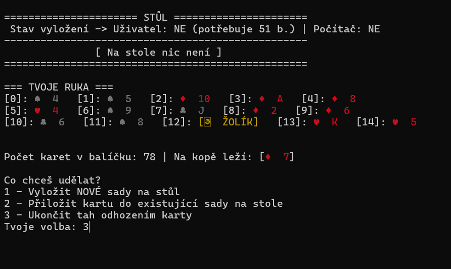
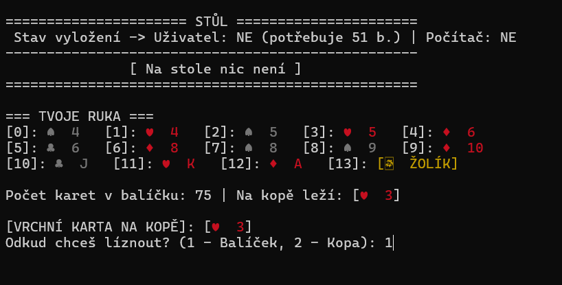
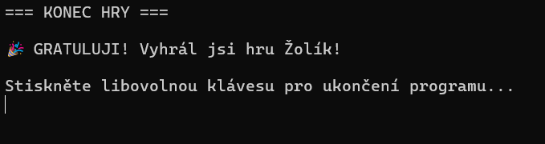

# 🃏 ZolikKonzole

Konzolová implementace karetní hry **Žolík** napsaná v jazyce C# jako školní nebo cvičný projekt. Aplikace simuluje rozdávání karet, tahy hráčů a logiku hry přímo v prostředí příkazové řádky.

---

## 🛠️ Použité technologie a koncepty

*   **Jazyk:** C# (.NET Core / .NET Framework)
*   **Architektura:** Objektově orientované programování (OOP)
*   **Rozhraní:** Konzoly (CLI)
*   **Klíčové koncepty:**
    *   Kolekce a práce s balíčkem karet (`List`, generické datové typy)
    *   Algoritmy pro míchání karet, ověřování herních kombinací (čisté postoupnosti, skupiny)
    *   Správa stavu hry a střídání tahů hráčů
    *   Enums pro reprezentaci barev a hodnot karet

---

## 🚀 Funkce projektu

- [x] **Správa balíčku:** Inicializace standardního balíčku karet, jeho zamíchání a doplňování z odhazovací hromádky.
- [x] **Správa hráčů:** Evidence karet v ruce jednotlivých hráčů.
- [x] **Herní mechaniky:** Lízání karty z balíčku nebo z odhazovací hromádky, vyhazování karty na konci tahu.
- [x] **Detekce kombinací:** (V závislosti na fázi vývoje) Validace vykládání karet podle pravidel hry Žolík.
- [x] **Konzolové UI:** Přehledný výpis aktuálního stavu hry, karet na stole a karet, které drží hráč v ruce.

---

## 📂 Struktura projektu

Níže je zobrazen přehled klíčových částí zdrojového kódu aplikace:

```text
ZolikKonzole/
├── assets/
│   ├── start-hry.png
│   ├── herni-tah.png
│   └── konec-hry.png
├── Program.cs             # Hlavní vstupní bod aplikace a řízení herní smyčky
├── Hra.cs                 # Logika samotné hry, správa tahů a herních fází
├── Balicek.cs             # Třída pro generování, míchání a lízání karet
├── Karta.cs               # Datový model jednotlivé karty (Barva, Hodnota, Žolík)
├── Hrac.cs                # Reprezentace hráče (Jméno, List karet v ruce, Skóre)
└── README.md
```

---

## 💻 Jak projekt spustit

Pro spuštění projektu na svém lokálním počítači budete potřebovat nainstalované **.NET SDK** (doporučeno .NET 6.0 nebo novější) nebo vývojové prostředí **Visual Studio / Rider**.

### 1. Klonování repozitáře
Otevřete si terminál a naklonujte projekt příkazem:
```bash
git clone https://github.com
```

### 2. Otevření a sestavení projektu
Přejděte do složky projektu:
```bash
cd ZolikKonzole
```

Sestavte projekt pomocí .NET CLI:
```bash
dotnet build
```

### 3. Spuštění hry
Hru v konzoli spustíte následujícím příkazem:
```bash
dotnet run
```

---

### 📸 Ukázky aplikace

#### Spuštění hry



#### Průběh hry



#### Konec hry



---